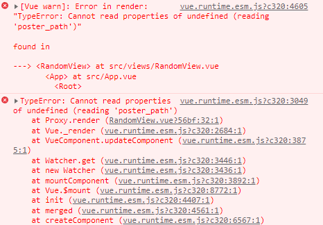

# 09_pjt

#### git을 활용한 협업

- 오늘 git을 활용해 협업을 하며 항상 이해가 잘 안됐던 git과 github 개념 구분이 명확해졌다
- 로컬 브랜치 만들어서 git commit하고 push 하는 법, 깃헙에 요청 올리는 법, master에서 pull 하는 순서를 익힐 수 있었다.
- node_modules 폴더랑 `env.local` 커밋할 때 지울 필요 없다. (`.gitignore`가 자동으로 걸러줌)


#### 최고평점영화 출력

- component에 Bootstrap Grid cards 적용하는 방법을 잘 몰랐다.

  - 아이템에서 카드 적용 따로 해야함

    ###### /MovieView.vue

    ```html
    <div class="row row-cols-1 row-cols-md-3 g-4">
    	<MovieCard/>
    </div>
    ```

    ###### /MovieCard

    ```html
     <div class="col">
        <div class="card" style="height:1000px;">
          
          <div class="card-body">
            <h5 class="card-title">{{ movie.title }}</h5>
            <p>{{ movie.overview }}</p>
          </div>
        </div>
      </div>
    ```

- 영화 포스터 이미지 가져올 때 `src`에 v-bind를 안해서 링크를 제대로 가져오지 못하는 실수를 했다.

  

#### API

- API 가져와서 사용하는 방법을 알게 되었다.
  - axios로 url 받아서 Vuex에 저장한다.
  - params 변수를 선언해 받아야하는 인자를 저장한다.
  - `env.local`에 키를 저장한다.


#### 보고싶은 영화 등록 및 삭제하기

- 그냥 상위 컴포넌트에 저장한 데이터를 사용하려다가 시청 완료 값을 변경하는 과정이 너무 헷갈려서 Vuex에 작성한 영화 목록을 저장해서 활용했다.


#### 최고 평점 영화 중 랜덤 영화 한 개 출력

처음 코드를 구현했을 때 무작위 영화를 뽑는 과정을 methods를 사용해 구현하였다. 

처음 Random페이지에 들어갔을 때 버튼을 누르지 않아도 바로 영화가 출력되도록 created에 위에서 만든 메서드를 호출하였다.

그 결과 원하는대로 Random페이지에 들어갔을때 바로 영화가 출력되었지만, 새로고침을 하면 영화가 표시되지 않았다.

이를 해결하기 위해 methods가 아니라 computed를 활용하여 아래와 같이 movie변수에 랜덤영화 정보를 담고 이를 출력했다. Random페이지에서 새로고침 했을 때 영화가 출력이 되었지만, 고정된 movie변수값으로 인해 버튼을 클릭하여도 영화가 바뀌지 않았다.

때문에 computed로 인한 랜덤영화 movie와 methods로 바뀌는 randomMovie 값을 같이 사용하였다. 첫 새로고침때는 movie로 그 이후 pick버튼을 누르면 randomMovie의 영화 정보가 출력되도록 v-if문을 사용하여 구현하였다.

이렇게 함으로써 새로고침할 때 영화가 출력되지 않던 문제와 버튼을 눌렀을 때 영화가 바뀌지 않던 문제를 해결하였다.


```vue
<template>
  <div class="pt-5">
    <div id="randmovie" class="mx-auto">
      <button class="btn btn-success col-12 mb-3" @click="getRandomMovie">PICK</button><br>
      <div v-if="randomMovie">
        
        <h3 class="mt-4">{{ randomMovie.title}}</h3>
      </div>
      <div v-if="!randomMovie">
        
        <h3 class="mt-4">{{ movie.title}}</h3>
    </div>
      
    </div>
  </div>
</template>

<script>
import _ from 'lodash'


export default {
  name: 'RandomView',
  data() {
    return {
      randomMovie: null
    }
  },
  computed: {
    movie() {
      return _.sample(this.$store.state.movieData)
    },
  }, 
  methods: {
    getRandomMovie() {
      const movieData = this.$store.state.movieData
      this.randomMovie = _.sample(movieData)
      // console.log(this.randomMovie)
    }
  },
}
</script>

<style>
img {
  width: 500px;
  height: 500px;
}
#randmovie {
  width: 500px;
}

</style>
```



모든 문제를 해결하고 Random페이지에서 새로고침을 눌렀더니 console창에서 위와같은 에러가 발생하였다.

우리조는 axios로 영화정보를 받고 이를 vuex의 store에 저장하는 방식을 활용하였다. 그리고 Random페이지에선 store.state의 영화 정보를 가져오는데, javascript에서는 비동기적으로 영화정보를 저장한 후에 Random페이지를 렌더링하지 않았다. 즉 영화정보가 저장되기 전에 Random페이지가 랜더링되어 Random페이지에서 사용하는 데이터가 존재하지 않게돼 위와같은 에러가 발생하던 것이었다.

이를 어떻게 해결할 수 있을까 고민해봤지만, 자바스크립트의 구조상 실행되는데 시간이 걸리는 axios작업은 다른 작업이 처리될 때 까지 Web API -> Task Queue 를 거쳐 마지막에 Call Stack에 들어가고 실행된다. 즉 지금 나의 기술로는 해결할 수 없는 문제였다.

vue, bootstrap 등 기술스택을 공부하는 것도 중요하지만 내가 사용하는 언어의 기본 동작 구조에 대한 이해가 필요하다고 생각했다.


